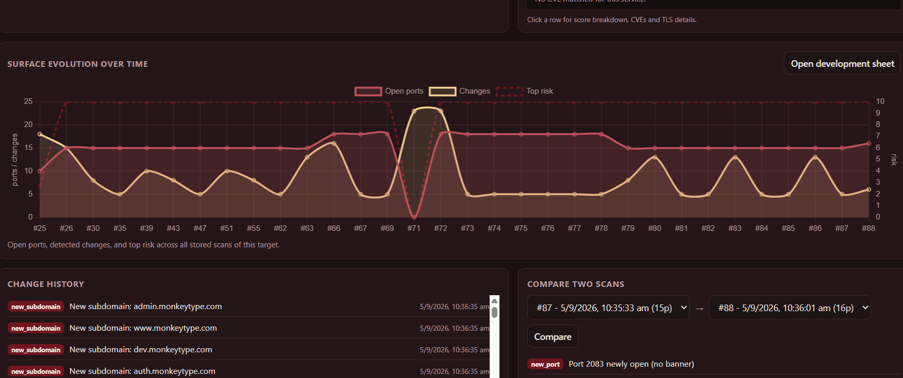
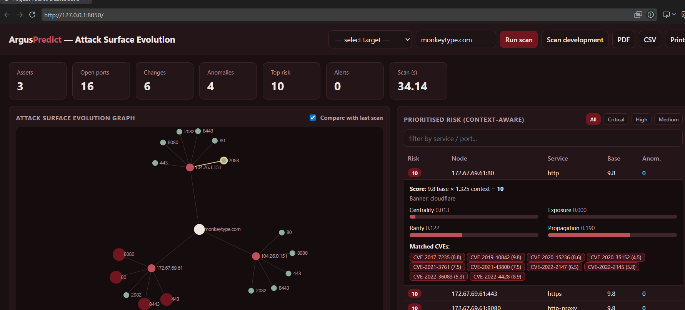

<h1 align="center">🛰️ ArgusPredict</h1>

<p align="center">
  <b>Keeping an eye on how an attack surface changes over time — and pointing out what actually matters.</b>
</p>

<p align="center">
  
  
  
</p>

<p align="center">
  
</p>

---

## Hi there 👋

I'm Shreeja, and this is my M.Sc. project. I built **ArgusPredict** because I kept
noticing the same thing while learning about security: most tools scan a system
*once*, hand you a giant list sorted by CVSS score, and leave you to figure out
what's important. But real systems don't sit still — a port opens after a
deployment, a forgotten subdomain wakes up, a service quietly updates. I wanted
something that *remembers* what a system looked like last time and tells me
**what changed** and **what's actually risky right now**.

So that's what ArgusPredict does. It scans an authorised target, saves the
result, and every time it runs again it compares against the past — building up a
picture of how the attack surface is *evolving*.

> ⚠️ **Please only scan things you're allowed to.** ArgusPredict will refuse to
> touch anything that isn't on its allow-list (`AUTHORISED_TARGETS`), and it only
> *looks* — it never tries to break in. `scanme.nmap.org` is a target the Nmap
> Project has made public for exactly this kind of learning.

---

## What it actually does

- 🔎 **Looks around (safely).** Finds DNS records, subdomains, open ports, service
  banners, WHOIS info, and TLS certificate details — all at the same time, so it's fast.
- 🧠 **Remembers.** Every scan goes into a database, so it can spot **new ports,
  closed ports, changed services, and new subdomains** between runs.
- 🕸️ **Draws the whole thing as a graph** (I call it the Attack Surface Evolution
  Graph) and can **overlay the current scan on top of the last one** so you *see*
  what appeared or disappeared.
- 🎯 **Ranks risk in a smart way.** Instead of just using the raw CVSS score, it
  asks *"where does this sit and how connected is it?"* and adjusts the score
  accordingly — so the things that really matter float to the top.
- 📈 **Shows the story over time** with a live chart and an on-demand
  "scan development" sheet.
- 🔔 Flags high-risk changes, ⏱️ can scan on a schedule, and 📄 exports a PDF/CSV report.

<p align="center">
  
</p>

---

## The clever bit: context-aware risk

Two services can have the exact same CVSS score but be *very* different in real
life — one might be a lonely test box, the other a central gateway everything
depends on. So instead of trusting the raw score, ArgusPredict does this:risk = CVSS × (1 + how-central-it-is + how-long-it's-been-exposed
+ how-rare-the-service-is + how-far-a-problem-could-spread)


(capped at 10). And it's **explainable** — click any row and it shows you exactly
why it scored what it did.

---

## Try it yourself

```bash
pip install -r requirements.txt

# a safe local test (no internet needed):
python main.py --target 127.0.0.1 --no-db --no-cve

# a real scan of the friendly practice target:
python main.py --target scanme.nmap.org
```

Want the dashboard (the pretty part)?

```bash
python -m argus.api.app
```

Then open **http://localhost:8050**, type an authorised target, and hit **Run
scan**. Scan the same target twice (change something in between!) and watch the
graph light up with what changed. 🎉

---

## What it's built with

Python · Flask · SQLAlchemy · NetworkX · scikit-learn (Isolation Forest) ·
D3.js + Chart.js for the visuals · Docker for deployment.

## How the code is organised

argus-asm/
├── main.py # run a scan from the command line
├── config.py # settings + the safety allow-list
├── argus/
│ ├── pipeline.py # ties one full scan together
│ ├── recon/ # dns, subdomains, ports, banners, whois, tls
│ ├── persistence/ # the database models + helpers
│ ├── detection/ # spots what changed
│ ├── analysis/ # the graph, anomalies, risk scoring, CVEs
│ └── api/ # the Flask app + the dashboard
└── tests/ # a few unit tests


---

## A little honesty 💬

This is a learning project, and I'm still improving it! The recon, storage,
change-detection, graph, and dashboard all work end to end. Some parts (like
fine-tuning the anomaly thresholds) get better the more history it collects.
If you have ideas or spot something, I'd genuinely love to hear it.

Thanks for reading — and thanks to my guide and everyone who helped along the way. 🙏
